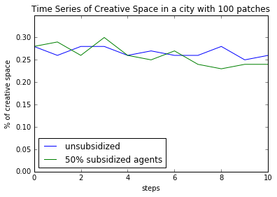
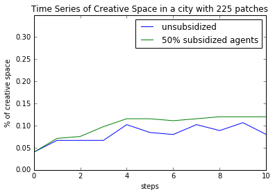
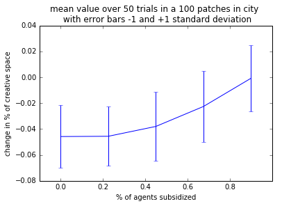
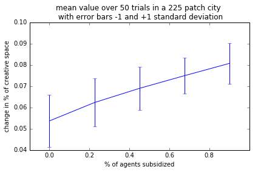
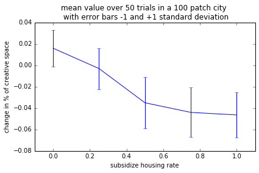
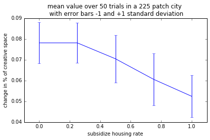
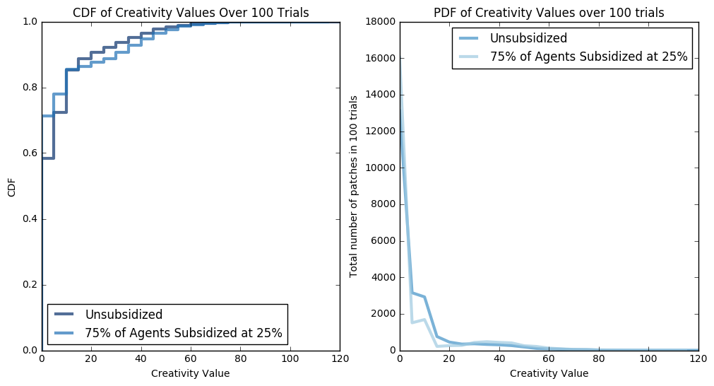

# Gentrification or Revitalization? A Complexity Science Approach
Margo Crawford and Ryan Louie

## Abstract
Community transition -- known as gentrification if its changes are unwelcome or revitalization if it is welcome -- is a divisive issue in cities across the world. While higher income residents entering a neighborhood can lead to a revitalized economy and more amenities, critics point out that original residents don't reap the benefits, because they are displaced by higher rents. Our project focuses on balancing an increase in creative, knowledge based industry in a city with minimal displacement of long term residents. We refine and expand on a model of creativity in cities (Malik et al.) to predict the effects of housing development with subsidized housing on the makeup of a neighborhood being gentrified. 

## Related Work

#### A. Malik et al. Exploring Creativity and Urban Development with Agent-Based Modeling Journal	of Artificial Societies and Social Simulation 18	(2) 12 <http://jasss.soc.surrey.ac.uk/18/2/12.html>

For developing cities, attracting creative individuals or those who bring about knowledge-based economies is a highly desired outcome.  An ABM of a city and its citizens is developed. The environment is a 2D grid described by land use, neighborhoods, creative space, and rent. The agents have attributes like income, education, tolerance, and creativity.  They used survey data from a developing city in Pakistan, as well as analysis of overhead map imagery in order to estimate proportions of different attributes in the environment and population. 

#### S. Brown. Beyond Gentrification: Strategies for Guiding the Conversation and Redirecting the Outcomes of Community Transition A paper submitted to Harvard’s Joint Center for Housing Studies and NeighborWorks America July 2014 

This paper does not come from the complexity literature.  Its insights comes from case studies and interviews of residents of areas that has experienced community transition: Jamaica Plain in Boston and Columbia Heights in DC. 

## Methodology
The agent based model developed by Malik et. al influenced many of our modeling decisions. The questions we posed included how residents would move in a city in response to increases in prices for housing, and how to maintain positive effects of revitalization of neighborhoods.  Malik et al. had created a complicated model that included but not limited to
- Agent movement due to rent costing higher than a threshold percentage of an individual's income, cost of a block 
- Agents having low, medium, and high creativity levels.
- The increased creativity value of agents positively correlated with a relative increase in income.
- Blocks would increase their creative value based on the creativity of their residents.
- The more creative value a block would have, the higher rents would increase from their starting value.

Our model is a 2D array, with cells representing land patches and agents assigned to each patch. The agents have an income and creativity value, and the patches have a rent. The agents move when they are unhappy due to not being able to afford rent. Shown below are two 2D cells, one right after the landscape was initialized, and the other after agents have moved around for 10 time steps. The darkness of the cell represents the population density of that cell. The agents are initialized evenly across the grid; however, after the agents decrease their overall movement after several time steps, the distribution is heavily skewed with a few patches containing a large portion of the population, while others remain sparse.

 | 
:--------------------------------:|:-----------------------------------:

In their subsequent investigation of optimizing for creativity in a city, Malik et al. focused on the change in creative value over the N time steps.  Our questioning is expanded from their focus only on maximizing creativity, in that we are focused on the balance of community transformation. The we use two metrics in our simulation to capture this balance: The positive effect from transformation is the change in creative value; the negative effect is the increased displacement of residents in neighborhoods.

Creativity value of a patch of land is measured based on the number of high and medium creative individuals in those patches. High creative individuals are worth 10, and medium are worth 5. All other agents don't contribute to the creative value. One useful visual for creativity in a city is a CDF of creativity values of all of the cells. The graph below shows two CDFs overlaid, one right after the city was initialized and the other after 10 time steps. After movement, more cells have very low creative values. Before agents move, 15% of the patches have a creativity value of zero, but that number increases to 40% after 10 timesteps. However, there are more patches with very high creative values after some movement. Before movement, only a couple of cells are above 40, but 10% of cells are above 40 after 10 steps. The CDF of creative value at initialization tails off at a highest value of 50, while the CDF of creative value after 10 times steps of movement attains its maximum value at 100.

 

Agents are continuously displaced throughout the model, due to inability to pay rent. The graph on the left below shows the number of agents moving vs. time for a run of the model. Although the number of agents who move tails off, it doesn't reach zero. On the right is a graph of cumulative number of agents displaced from their original homes. After about 15 timesteps, about 82.5% of agents have moved at least once due to rent being too high. When we swept different parameters, we took the y value of the right graph after a certain time step for many runs of the model.

 | 
:--------------------------------:|:-----------------------------------:

We added new components to the model, in order to model policies that curb negative effects like displacement. We took inspiration from cities like San Francisco, where subsidized housing is provided for residents.

- Subsidized Agents make up a user-defined percentage of the population and pay their housing costs at some reduced rate.
- Subsidized Housing is developed whenever new residential housing is built.

We implemented subsidization based on welfare; this choice was arbitrary, although we imagine the effects would be distinct when we allow for expansion of the city; both in the number of agents and the continued development of residential spaces. 

Malik et al. included other model dynamics.  In the ideal case, a thorough sensitivity analysis would have been conducted, to validate that the removal of features in the model would yield similar results.  However, we took a qualitative approach, and decided to strip certain parts away that did not do work for us in answering our question.

## Experiments

### Question: How does subsidization affect the rate of displacement of original renters?

__Methodology__: The model takes in an optional input of percentage of agents who get subsidized housing. Then, the lowest income residents are given subsidized housing, which means that they pay a below market rate. We ran simulations in which we gave 50% of the population subsidized housing and varied the percentage of rate which they paid. We aimed to measure the difference subsidization rates made in the amount of displacement that occured. 
Shown below is a time series for displacement in each time step and a cumulative one for the number of agents displaced from their original homes, compared for a subsidized and unsubsidized city. The city with subsidization has much less movement in both graphs. For the displacement per step, it starts out with a lower value and continues to decrease. For the cumulative graph, it starts lower and levels off to a lower level.

__Results:__
We wanted to get more conclusive evidence, so we ran many experiments for values of 25%, 50% and 75% of market rate at 50% of agents subsidized, and found the cumulative number of displaced agents after 20 timesteps and the number displaced at the 20th timestep. Shown below is a graph of 1000 trials for each subsidisation rate, with errorbars.

 | 
:--------------------------------:|:-----------------------------------:

__Interpretation__: As shown in the graph, the x axis displays how much subsidized agents are required to pay.  Lower values describe agents which receive more subsidies, and are thus required to pay less for their housing.There is a positive correlation between the amount agents are required to pay for rent and the number of agents displaced. Lower rents for subsidized agents, which would be the result of a more aggressive subsidization policy, allow for less displacement both cumulatively and per timestep.

### Question: How does subsidization affect the diffusion of creativity in a city?

__Methodology__: Subsidization policies varied on two dimensions: how many agents are subsidized and the amount of money an agent receives in subsidies . These dimensions were defined in terms of percent of population subsidized and percentage of rent an agent pays out of pocket, the rest covered by subsidization.

For the metric of creativity spread in a city, we used the percent of residential cells that are “creative spaces”, defined as having K number of medium or high creative agents living in the cell. We defined K=3, following the model of Mallik et al.  By taking the proportion of creative spaces before simulation and after 10 steps of simulation with different policies active, we can measure how different policies affect the change of creative space.

Finally, we varied the number of patches in the city. When holding the population of agents constant, increasing the number of patches decreases population density at initialization.  Population density is related to the amount of creative individuals in each patch and thus the creative value of patches.  With higher density, the amount of creative spaces in a city was higher upon initialization.

 

The unexpected effect of varying the population density was that percentage change in creative space depended on this initial parameter.  As shown for a single model run holding all initialization constant, a 10x10 grid with 100 patches shows a decrease in the percentage of creative space over time, while a 15x15 grid with 225 patches shows the opposite trend.

__Results__: In the graphs below, the number of agents being subsidized is being varied, while the amount of rent each subsidized agent is paying is held constant at 50% of the market rate.  A positive correlation can be found between the percentage of the population on subsidization and the change in the percentage of creative space;  this observation stands variations in the initial population density too.  

 

We note that in the 100 patch city, the change in the percentage of creative space after 10 steps is negative, on average.  In the 225 patch city, the opposite is true: every policy leads to increases in the percentage of cells that are creative spaces.  In both cases, making subsidization available for more agents results in better outcomes when optimizing for the amount of creative space in a city.

When testing subsidization policies that varied the amount of rent each agent pays while holding the percentage of agents subsidized constant at 45% of the population, we found a similar correlation between increased subsidization and better creativity outcomes.  Note that the "subsidized housing rate" defines the proportion of rent an agent pays out of pocket.  In the 0.0 extreme, agents pay nothing and receive maximum subsidies; while in the 1.0 extreme, agents pay everything and receive no subsidies.

 

__Interpretation__: In the context of the broader question, this result indicates that more aggressive subsidization -- either by giving subsidies to more people or increasing the monetary amount of subsidies -- has a positive effect on increasing the number of creative spaces in a city.

Looking at the distribution of creative value for a simulations of city that implements both an aggressive subsidization rule and a zero-subsidization rule sheds light onto why this behavior exists.

A creative space in our model is defined as having 3 medium or high creative individuals in a patch. The minimum creative value of a patch for it to be labeled a creative space is 15 (3 medium creative individuals contributing their 5 points of creativity each).  Thus it is helpful to look at how the distribution of creative value in patches compares for values under 15, including {0, 5, 10}.  Remember that creative values {5, 10} represent patches where a few high or medium creative individuals live, but where a patch is not considered a creative space. Let us call this type of patch one with "lost potential", to describe the idea that creative agents who live in non-creative spaces are essentially losing the opportunity to contribute to patches that have more high or medium creatives like them.

__Distributions of Creative Value, after 10 time steps have elapsed__:

From the distributions above, the subsidized city has more patches with a creative value of 0, but less patches for a creative value of {5, 10}. This indicates that subsidized cities have fewer "lost potential" patches. These creative individuals instead are congregating with other high or medium creative individuals, forming more creative spaces.  This demonstrates a more granular view of how aggressive subsidization can help creatives stick together.  Our hypothesis is that subsidization is helping low-income creative individuals stay in highly creative patches despite a rising rental cost of these areas; we will leave it to future work to confirm that this intuition is correct.

## Learning Goals

#### Margo: 

##### Initial Learning Goals:

I would like to use the process of converting the creativity model to Python to understand it better, and figure out how to simplify things. The paper that we are basing our model off of used NetLogo, so one of our first steps will be to move that to Python, and I think that process will be very valuable. I want to get better at evaluating results quantitatively (through evaluating punchline graphs and comparing different versions of the model). Our project makes sense for this because we are trying many different iterations of our model with some variables eliminated, so showing when and where they differ will be important.

##### Reflection:

I think I was most successful at my learning goal of evaluating results quantitatively. In our project, we produced lots of different metrics of success for runs of the model and parameter sweeps. Some of those included CDFs, PDFs, values after a certain number of time steps, and linear regression. I feel more confident in my ability to use statistical tools to evaluate results. I'm somewhat satisfied with the other learning goal of understanding our reference model better by moving it to python. I think I learned a lot from that process, but we ended up going off in our own direction pretty early in the project, so we didn't have a direct comparison from ours to the paper's. We still used a lot of the properties of the model, and I think I understood most of it.

#### Ryan: 

##### Initial Learning Goals:

I would like to practice on my creation and delivery of compelling punchline graphs. This project will help me, because one of our extensions will be ensuring that the punchline stays the same, despite simplifications of the model.  In addition, since we plan to explore the relationship between gentrification and movement of creativity into a city, we will need to generate novel punchlines too.  Finally, I am generally curious about the topic of technology/creativity in cities interacts with the uprooting of poorer households.  I will be satisfied with more real-world theory and understanding If I can learn about the theory in this field, and some strategies cities are thinking about to achieve desirable outcomes to balance these two.

##### Reflection:

I was able to satisfy my learning goals during the data analysis and interpretation phases of the project. We encountered many problems that disagreed with our initial hypothesis about the model.  This required careful follow up in the generation of new graphs.

Most of my learning happened during the process of refining the graph of change in creative space for different subsidization policies.  For the draft presentation, I presented results that showed that change in creative value was never positive, on average, which seemed like a failure of our model. I gained a better understanding of the model by realizing that size of the grid affected the amount of creative space at the start, which affected the change in creative space later on.  Writing the interpretation section for this question also helped me link a more granular view of creative value in patches to the results we found in the punch line graph. Explaining this gave me practice in making a more convincing case for the punchline graph.  

