# Gentrification or Revitalization? A Complexity Science Approach
Ryan Louie '17 and Margo Crawford '19

## Abstract
Community transition -- known as gentrification if its changes are unwelcome or revitalization if it is welcome -- is a divisive issue in cities across the country. While higher income residents entering a neighborhood can lead to a revitalized economy and more amenities, many are concerned that the original residents don't reap the benefits, because they are displaced by higher rents. Our project will focus on balancing an increase in creative, knowledge based industry in a city with minimal displacement of long term residents. We will refine and expand on a model of creativity in cities (Ammar Malik et al.) to predict the effects of housing development with subsidized housing on the makeup of a neighborhood being gentrified. 

## Related Work

#### Ammar Malik et al. Exploring Creativity and Urban Development with Agent-Based Modeling Journal	of Artificial Societies and Social Simulation 18	(2) 12 <http://jasss.soc.surrey.ac.uk/18/2/12.html>

For developing cities, attracting creative individuals or those who bring about knowledge-based economies is a highly desired outcome.  An ABM of a city and its citizens is developed. The environment is a 2D grid described by land use, neighborhoods, creative space, and rent. The agents have attributes like income, education, tolerance, and creativity.  They used survey data from a developing city in Pakistan, as well as analysis of overhead map imagery in order to estimate proportions of different attributes in the environment and population. 

#### S. Brown. Beyond Gentrification: Strategies for Guiding the Conversation and Redirecting the Outcomes of Community Transition A paper submitted to Harvard’s Joint Center for Housing Studies and NeighborWorks America July 2014 

This paper does not come from the complexity literature.  Its insights comes from case studies and interviews of residents of areas that has experienced community transition: Jamaica Plain in Boston and Columbia Heights in DC. 

## Methodology
The agent based model developed by Ammar Malik et. al influenced many of our starting modeling decisions. We were interested in seeing how residents would move in a city in response to increases in prices for housing, and wanted to also measure positive effects of revitalization of neighborhoods.  The authors had created a complicated model that included but not limited to
- agent movement due to rent costing higher than a threshold percentage of an individual's income, cost of a block 
- agents having low, medium, and high creativity levels
- the increased creativity value of agents positively correlated with a relative increase in income
- blocks would increase their creative value based on the creativity of their residents
- The more creative value a block would have, the higher rents would increase from their starting value

Our model is a 2D array, with cells representing land patches and agents assigned to each patch. The agents have an income and creativity value, and the patches have a rent. The agents move when they are unhappy due to not being able to afford rent. Shown below are two 2D cells, one right after the landscape was initialized, and the other after agents have moved around for 10 time steps. The darkness of the cell represents the population density of that cell. The agents start out pretty evenly spread, and move around, generally converging on a few very popular cells and some very sparse ones.

 | 
:--------------------------------:|:-----------------------------------:

In their subsequent investigation of optimizing for creativity in a city, the authors focused on the change in creative value over the N time steps.  Our questioning is expanded from their focus only on maximizing creativity, in that we are focused on the balance of community transformation. The we use two metrics in our simulation to capture this balance: The positive effect from transformation is the change in creative value; the negative effect is the increased displacement of residents in neighborhoods.

To observe change in creativity, we had several different metrics. Creativity value of a patch of land is measured based on the number of high and medium creative individuals in those patches. High creative individuals are worth 10, and medium are worth 5. All other agents don't contribute to the creative value. One useful visual for creativity in a city is a CDF of creativity values of all of the cells. The graph below shows two CDFs overlaid, one right after the city was initialized and the other after 10 time steps. After movement, more cells have very low creative values. Before agents move, 15% of the patches have a creativity value of zero, but that number increases to 40% after 10 timesteps. However, there are more patches with very high creative values after some movement. Before movement, only a couple of cells are above 40, but 10% of cells are above 40 after 10 steps. The CDF for before movement tails off at a highest value of 50, while the highest value after movement is 100.

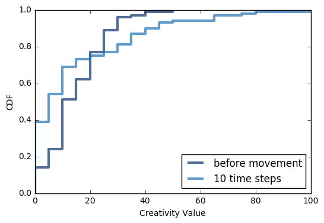 

Agents are continuously displaced throughout the model, due to inability to pay rent. The graph on the left below shows the number of agents moving vs. time for a run of the model. Although the number of agents who move tails off, it doesn't reach zero. On the right is a graph of cumulative number of agents displaced from their original homes. After about 15 timesteps, about 82.5% of agents have moved at least once due to rent being too high. When we swept different parameters, we took the y value of the right graph after a certain time step for many runs of the model.

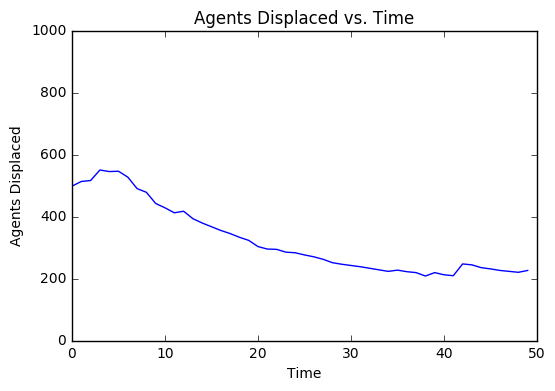 | 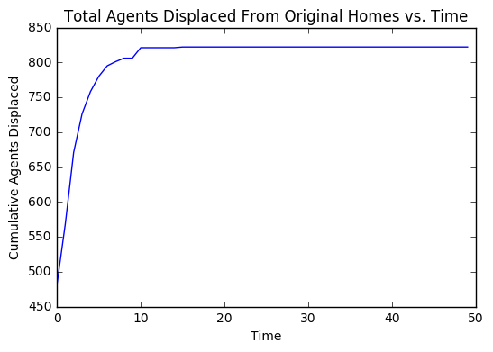
:--------------------------------:|:-----------------------------------:

We added new components to the model, in order to model policies that curb negative effects like displacement. We took inspiration from cities like San Francisco, where subsidized housing is provided for residents.

- Subsidized Agents (Welfare).  Both in the percentage of the population that is subsidized, and the rate at which each agent is subsidized.
- Subsidized Housing Developed whenever new residential housing is built.

We implemented subsidization based on welfare; this choice was arbitrary, although we imagine the effects would be distinct when we allow for expansion of the city; both in the number of agents and the continued development of residential spaces. 

The authors included other model dynamics.  In the ideal case, a thorough sensitivity analysis would have been conduct`ed, to validate that the removal of features in the model would yield similar results.  However, we took a qualitative approach, and decided to strip certain parts away that did not do work for us in answering our question.

The first experiment that we ran was on the effect of subsidization on rate of displacement of agents. This question shows if our tweaks in the model have a positive effect on low income agents. Since one of our main objectives is to investigate ways to keep low income residents in their homes, this is a vital result. 

The second experiment was how the level of subsidization effects the displacement of residents. The renters who qualify for subsidized housing pay some fraction of the market value in rent, and we’d like to know how much that percentage can be while still being effective at preventing displacement.

The third experiment was how subsidization effects the creativity value of cells. In the NetLogo model, we observed a lot of clustering of creative agents in certain cells. Since creative agents earn more, they may live in squares that low creative agents can’t afford. We’d like to know if and how adding subsidized housing changes the distribution of creativity.

## Experiments

### Question: How does subsidization affect the rate of displacement of original renters?

Methodology: The model takes in an optional input of percentage of agents who get subsidized housing. Then, the lowest income residents are given subsidized housing, which means that they pay a below market rate. We ran simulations in which we gave 50% of the population subsidized housing and varied the percentage of rate which they paid. We aimed to measure the difference subsidization rates made in the amount of displacement that occured. 
Shown below is a time series for displacement in each time step and a cumulative one for the number of agents displaced from their original homes, compared for a subsidized and unsubsidized city. The city with subsidization has much less movement in both graphs. For the displacement per step, it starts out with a lower value and continues to decrease. For the cumulative graph, it starts lower and levels off to a lower level.

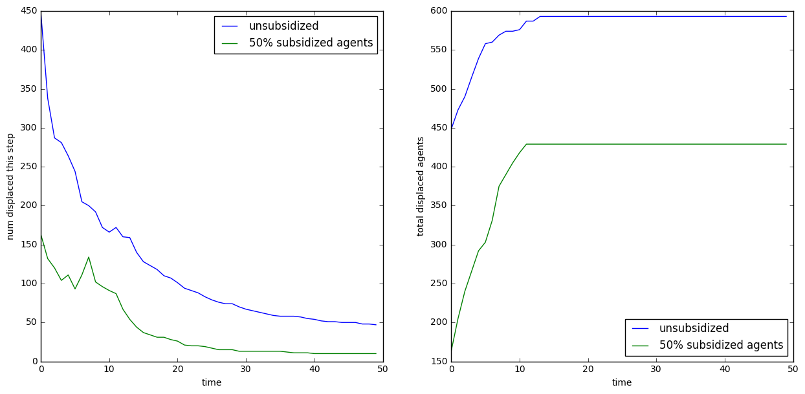

We wanted to get more conclusive evidence, so we ran many experiments for values of 25%, 50% and 75% of market rate at 50% of agents subsidized, and found the cumulative number of displaced agents after 20 timesteps and the number displaced at the 20th timestep. Shown below is a graph of 1000 trials for each subsidisation rate, with errorbars.

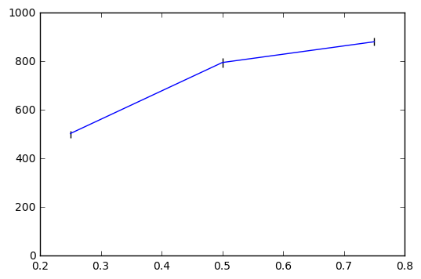 | 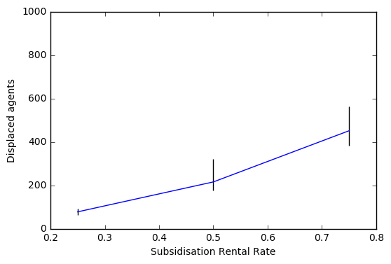
:--------------------------------:|:-----------------------------------:

Interpretation: As shown in the graph, there is a positive correlation between amount of rent paid for subsidized agents and number of agents displaced. Lower rents for subsidized agents, which would be the result of a more aggressive subsidization policy, allow for less displacement both cumulatively and per timestep. 

### Question: How does subsidization affect the diffusion of creativity in a city?

What we did:

- What percentage of the population was on subsidization / housing welfare.
- Divided the range between 0 - 90% into 5 equally space intervals
- 1000 trials were run where a city was allowed to evolve over 50 time steps (which is the equivalent of 50 years in our model... yikes!)
- Each trial was seeded with the same starting conditions 
Methodology:  The two settings we compared for subsidization was 0% of the population and 50% of the population being on 50% subsidization on their rent.  For the metric of creativity spread in a city, we used the % of residential cells that are “creative spaces”, defined as having X number of creative agents living in the cell.  

The city I used was a 10 by 10 grid, with the average rent starting at 12000 currency units and the population of agents totaling 1000.  The number of individuals required to label a cell as creative was just 3.

Results: Below is several graphs, where a city is initialized with particular agents.  Then the scenario is played through for 50 time steps. 

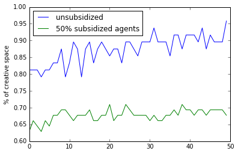 | 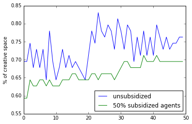
:--------------------------------:|:-----------------------------------:
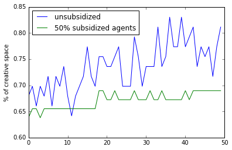| 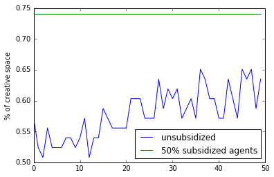

Interpretation: Note that these are across multiple trials.  Since the distribution of agents across the residential cells is random, we can expect the percent of creative space to also be random

Visually, I might suppose that on average, a unsubsidized policy results in a higher increase in % of creative space.  However, over 4 trials, that claim cannot be concluded.

In addition, the graph for subsidized agents has a smaller variation.  This corresponds to smaller changes in the percent of creative spaces per time step.  This could be correlated to less movement of agents around, which shuffle the distributions of creative people over creative space.

### Question: Do more agents move when there is no subsidized housing?

It would make sense, that with subsidization, more agents are happy and are not being displaced by rent hikes.  This would also explain the reduced variation in the percent of creative space graphs, discussed above.

Results:

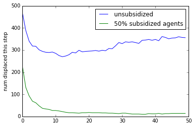 | 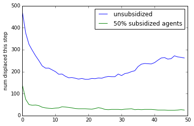

The number of agents moving per time step, over 50 time steps.  There is intense moving at the beginning, due to the fact that probably many poor agents are initialized in regions where rent is high.  

In the subsidized case, there is a monotonic trend towards moving less and less.  It approaches a steady state quickly.

For unsubsidized, however, we can see that movement starts to increase near time step 15, and continues to increase.  This might relate to creative value and thus rental prices over time, which would make the environment more pressured to move for individuals.

Interestingly, we can look at both how movement of people are viewed in a city as well as the effect on changes in the percentage of creative space. Below, subsidization provides a benefit in both regards. Again, disclaimer that this is one trial and the numbers are no way indicative of a larger trend.  The sensitivity to randomness is something we aim to fix in the model in order to study these policy decisions better.

change in % of creative space in unsubsidized city: -1.6 %
change in % of creative space in 50% subsidized city: 3.0 %

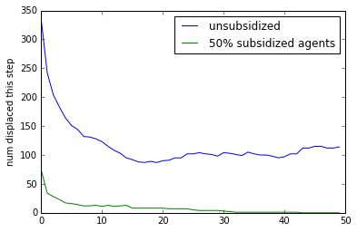

## Future Work
We still need to create graphs comparing effectiveness at curbing gentrification and creativity of population. 

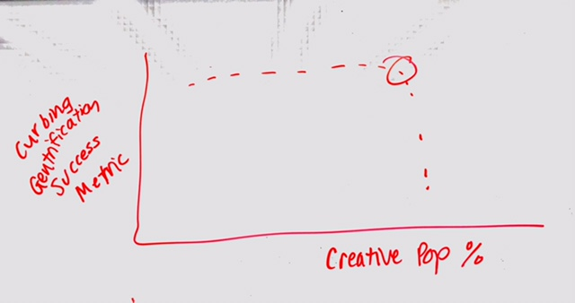

## Learning Goals
_Margo_: 

Initial Learning Goals:

I would like to use the process of converting the creativity model to Python to understand it better, and figure out how to simplify things. The paper that we are basing our model off of used NetLogo, so one of our first steps will be to move that to Python, and I think that process will be very valuable. I want to get better at evaluating results quantitatively (through evaluating punchline graphs and comparing different versions of the model). Our project makes sense for this because we are trying many different iterations of our model with some variables eliminated, so showing when and where they differ will be important.

Reflection:

I think I was most successful at my learning goal of evaluating results quantitatively. In our project, we produced lots of different metrics of success for runs of the model and parameter sweeps. Some of those included CDFs, PDFs, values after a certain number of time steps, and linear regression. I feel more confident in my ability to use statistical tools to evaluate results. I'm somewhat satisfied with the other learning goal of understanding our reference model better by moving it to python. I think I learned a lot from that process, but we ended up going off in our own direction pretty early in the project, so we didn't have a direct comparison from ours to the paper's. We still used a lot of the properties of the model, and I think I understood most of it.

_Ryan_: I would like to practice on my creation and delivery of compelling punchline graphs. This project will help me, because one of our extensions will be ensuring that the punchline stays the same, despite simplifications of the model.  In addition, since we plan to explore the relationship between gentrification and movement of creativity into a city, we will need to generate novel punchlines too.  Finally, I am generally curious about the topic of technology/creativity in cities interacts with the uprooting of poorer households.  I will be satisfied with more real-world theory and understanding If I can learn about the theory in this field, and some strategies cities are thinking about to achieve desirable outcomes to balance these two.

